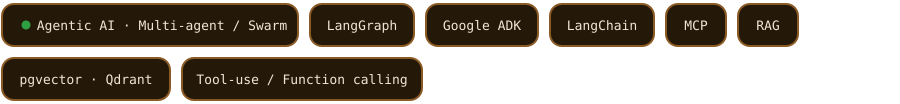
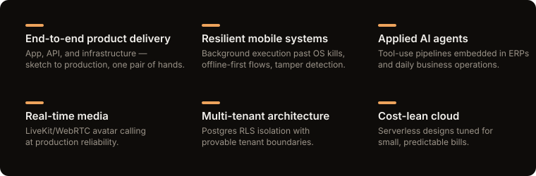

# Hi, I'm Anandu 👋

**I build AI agents that run real businesses** — multi-agent systems, WhatsApp
automation, and real-time avatar calls, shipped end-to-end from the mobile app
to the cloud infra.

### Agentic AI Engineering

`ops` — ✓ traced & observable (OTel · Grafana · Sentry) · ✓ human-in-the-loop elicitation · ✓ cost-budgeted · ✓ tenant-isolated · ✓ threat-modeled

### Stack

### Shipped — behind closed doors

| | Problem | Built | Status |
|---|---|---|---|
| 💬 **WhatsApp accounting assistant** | SMEs won't open an ERP, but they answer WhatsApp in seconds | AI agent running invoices & books over chat — Odoo/Tally integration, multi-tenant Postgres RLS, serverless AWS | 🟢 In production |
| 📍 **Field-ops location platform** | Field-staff GPS reporting where every dropped point is a dispute | Tamper-evident capture → buffered batch pipeline → route & distance reporting; [expo-livetrack](https://github.com/Anandu-tr/expo-livetrack) grew out of this | 🟢 In production |
| 🎥 **Real-time AI video avatars** | Human-like calling experiences at software cost | LiveKit/WebRTC calling with AI-driven avatars — low-latency media plumbing meets agent orchestration | 🟢 In production |

The code is private; the thinking isn't — the avatar calling system, end to end:

### Expertise

### Activity

### My contribution graph, under attack

Regenerated daily by [gh-space-shooter](https://github.com/czl9707/gh-space-shooter) — each enemy is one day of commits; darker green means a tougher fight.

---

  
  &nbsp;&nbsp;
  

