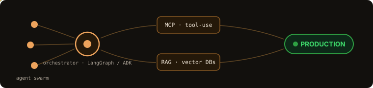
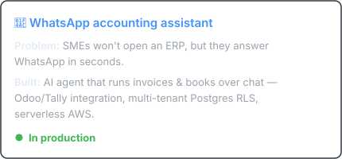
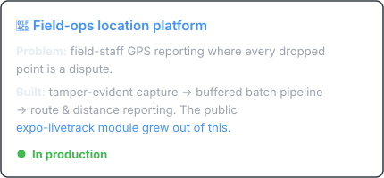
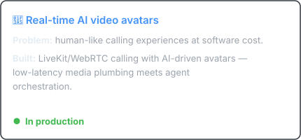
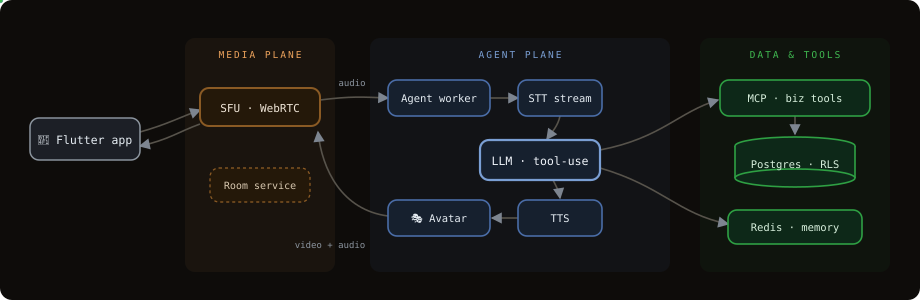
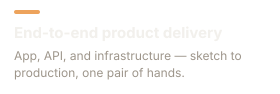
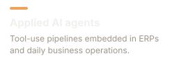
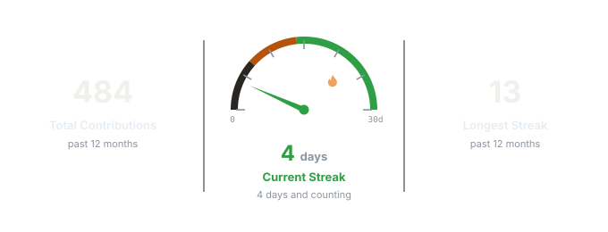
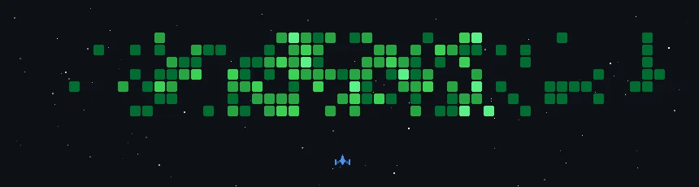

# Hi, I'm Anandu 👋

**I build AI agents that run real businesses** — multi-agent systems, WhatsApp
automation, and real-time avatar calls, shipped end-to-end from the mobile app
to the cloud infra.

## $\tiny\color{#eda35c}{\textsf{AGENTIC AI ENGINEERING}}$

$\small\color{#eda35c}{\textsf{OPS}}$ &nbsp; $\small\color{#3fb950}{\checkmark}$ $\small\color{#8b949e}{\textsf{traced \& observable (OTel, Grafana, Sentry)}}$ &nbsp; $\small\color{#3fb950}{\checkmark}$ $\small\color{#8b949e}{\textsf{human-in-the-loop elicitation}}$ &nbsp; $\small\color{#3fb950}{\checkmark}$ $\small\color{#8b949e}{\textsf{cost-budgeted}}$ &nbsp; $\small\color{#3fb950}{\checkmark}$ $\small\color{#8b949e}{\textsf{tenant-isolated}}$ &nbsp; $\small\color{#3fb950}{\checkmark}$ $\small\color{#8b949e}{\textsf{threat-modeled}}$

## $\tiny\color{#eda35c}{\textsf{STACK}}$

## $\tiny\color{#eda35c}{\textsf{SHIPPED — BEHIND CLOSED DOORS}}$

  

$\small\color{#8b949e}{\textsf{The code is private; the thinking is not - the avatar calling system, end to end:}}$

## $\tiny\color{#eda35c}{\textsf{EXPERTISE}}$

     

## $\tiny\color{#eda35c}{\textsf{ACTIVITY}}$

## $\tiny\color{#eda35c}{\textsf{MY CONTRIBUTION GRAPH, UNDER ATTACK}}$

 

  &nbsp;&nbsp;

